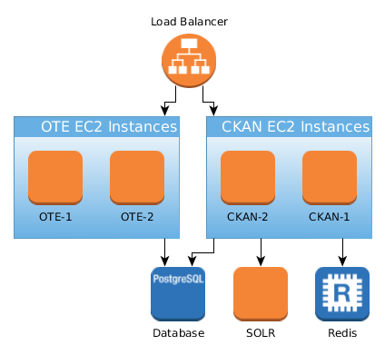

# Transport and Communications Agency (Finland): National Access Point and digitizing tools

The Finnish National Access Point as defined in [MMTIS directive](https://ec.europa.eu/transport/sites/transport/files/c20173574-multimodaltravelinformationservices-delegatedregulation.pdf). Contains a service catalogue for transportation service data and APIs as well as tools for digitizing transportation service data. The catalogue portal is partially based on CKAN.

The live NAP service can be found at https://finap.fi. The service instance is built from the code in this repository.

The background of NAP in Finnish legislation is Government Decree 643/2017 that defines essential information on transportation services (https://www.finlex.fi/fi/laki/alkup/2017/20170643). The decree requires transportation service operators to provide open interfaces for information such as routes, timetables, pricing, accessibility, etc.

NAP is the Finnish catalogue service for such essential information. It also includes tools for digitizing basic information for service providers that do not have their own means to do so. The latter functionality is aimed at small companies - it is assumed that larger organizations have their own systems that can export data and APIs. However, also these larger companies use NAP to publish their own interfaces.

## Structure of the repository

Directories:

* `nap` contains the NAP CKAN portal extensions, configurations and scripts
* `ote` contains the OTE digitalization tools application (both frontend and backend)
* `aws` contains configuration and scripts for setting up the cloud environments (except secrets, like keys)
* `database` contains migrations and test data to setup the OTE database

## Architecture

Here is a overview of our AWS production architecture. CI and other development related parts are not included.

## Development environment setup

 - [Database setup](https://github.com/finnishtransportagency/mmtis-national-access-point/blob/master/database/README.md)
 - [Cypress setup](https://github.com/finnishtransportagency/mmtis-national-access-point/blob/master/cypress/README.md)
 - [AWS](https://github.com/finnishtransportagency/mmtis-national-access-point/blob/master/aws/ansible/README.md)
 - [CircleCI](https://github.com/finnishtransportagency/mmtis-national-access-point/blob/master/.circleci/README.md)
 - [Docker](https://github.com/finnishtransportagency/mmtis-national-access-point/blob/master/nap/docker/README.md)
 - [Route Changes DevEnv setup](https://github.com/finnishtransportagency/mmtis-national-access-point/blob/master/docs/devsetup-route-changes.md)
 - [Netex configuration DevEnv setup](https://github.com/finnishtransportagency/mmtis-national-access-point/blob/master/docs/devsetup-netex.md)
 - [Chouette](https://github.com/finnishtransportagency/mmtis-national-access-point/blob/master/tools/chouette/README.md)
 - [Geometry Data](https://github.com/finnishtransportagency/mmtis-national-access-point/blob/master/docs/geometry-data.md)

## API documentation
 
  - [Search Service Api documentation](https://github.com/finnishtransportagency/mmtis-national-access-point/blob/master/docs/api/README.md)

## Transit changes documentation

 - [Transit changes](https://github.com/finnishtransportagency/mmtis-national-access-point/blob/master/docs/transit-changes/README.md)
 
 

