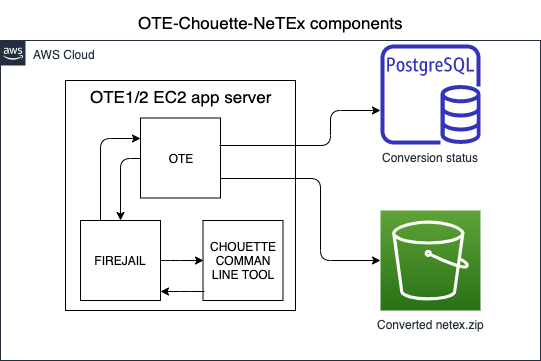

# NeTEx conversion documentation

## References
[0]: https://github.com/finnishtransportagency/mmtis-national-access-point/commit/158eddc78bd5ce368dc3afc524b152d691f8b74b
[1]: http://www.finlex.fi/fi/laki/alkup/2017/20170320 "Laki liikenteen palveluista"
[2]: https://developers.google.com/transit/gtfs/

- http://netex-cen.eu
- http://www.transmodel-cen.eu
- https://github.com/NeTEx-CEN/NeTEx
- https://enroute.mobi/produits/chouette
- http://www.chouette.mobi/en/ 
- https://github.com/enroute-mobi/chouette-core
- https://github.com/enroute-mobi/chouette-core-iev
- https://github.com/enroute-mobi/chouette-core-iev/tree/master/mobi.chouette.command

## Description

NeTEx is a CEN Technical Standard for exchanging Public Transport schedules and related data.
"Although NeTEx is a large standard, a NeTEx service needs only to implement the specific elements relevant to 
its business objectives – extraneous elements present in the model can be ignored. Parties using NeTEx for a 
particular purpose will typically define a “profile” to identify the subset of elements that must be present, 
as well as the code sets to be used to identify them"

### Need

Provide data of scheduled traffic in european NeTEx format.
 
### Requirements

Latest version of Chouette is described here: https://enroute.mobi/produits/chouette
Download comman line tool from: https://github.com/enroute-mobi/chouette-core
JVM, access to comman line.

## Datamodel

Related database tables:
- `netex-conversion`: each record represents the result of conversion run for an interface

## Functionality
Finnish NAP converts automatically the GTFS and Kalkati schedule traffic data packages which it downloads, into NeTEx format.  
Conversion is done using a chouette java library, which is invoked using a shell script.
Documentations how to install and use: https://github.com/afimb/chouette/blob/master/doc/command/examples.md

## Notes for developers

Get documentation and instructions how to install and use command line tool: https://github.com/enroute-mobi/chouette-core-iev/tree/master/mobi.chouette.command
- Example input/export parameters : https://github.com/afimb/chouette/tree/master/mobi.chouette.command/src/main/resource
- Example exportNetex projection_type is 27572 (Lambert), use 4326  (WGS84) for Finnish GTFS.
- Example invocation: `./chouette.sh -i ../convert-input/importGtfs.json -o ../convert-input/exportNetex.json -f ../convert-output/output.zip ../convert-input/gtfs.zip`
- Review conversion reports for any errors and warnings:  /work/inputReport.json , /work/outputReport.json , /work/validation_report.json  