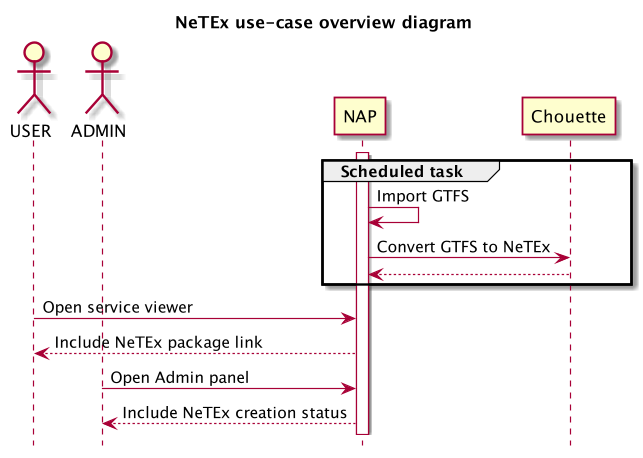
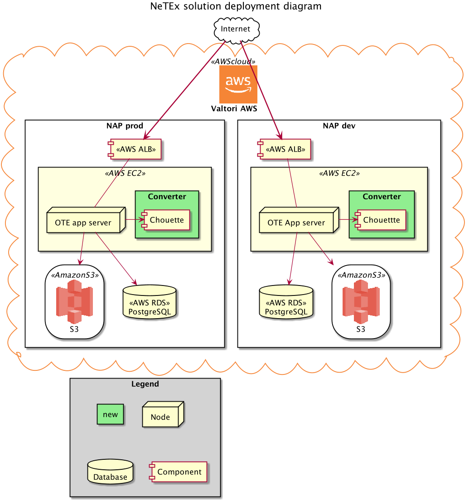
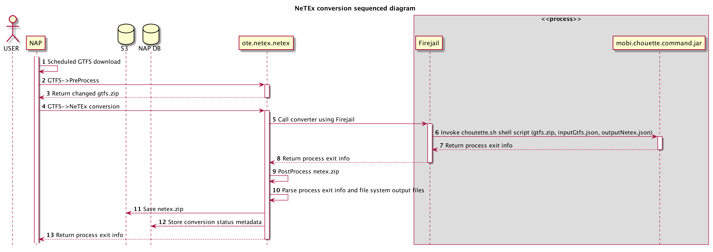

# NeTEx conversion documentation

## References
[0]: https://github.com/finnishtransportagency/mmtis-national-access-point/commit/158eddc78bd5ce368dc3afc524b152d691f8b74b
[1]: http://www.finlex.fi/fi/laki/alkup/2017/20170320 "Laki liikenteen palveluista"
[2]: https://developers.google.com/transit/gtfs/

- http://netex-cen.eu
- http://www.transmodel-cen.eu
- http://www.chouette.mobi/en/ 
- https://github.com/enroute-mobi/chouette-core
- https://github.com/enroute-mobi/chouette-core-iev
- https://github.com/enroute-mobi/chouette-core-iev/tree/master/mobi.chouette.command

## Description

### Need

Provide data of scheduled traffic in european NeTEx format.
 
### Requirements

## Datamodel

Related database tables:
- `netex-conversion`: each record represents the result of conversion run for an interface

## Functionality
Finnish NAP converts automatically the GTFS and Kalkati schedule traffic data packages which it downloads, into NeTEx format.  
Conversion is done using a chouette java library, which is invoked using a shell script.

## Notes for developers

