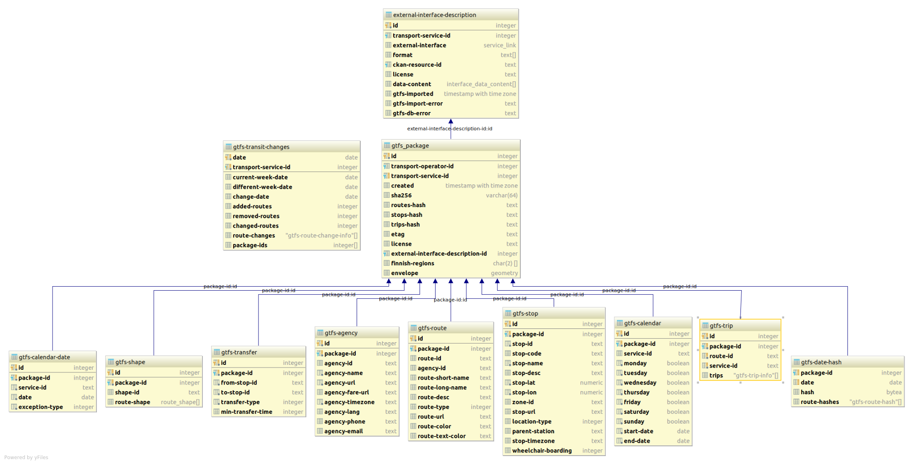

# Transit changes documentation

All changes in transit traffic must be informed to the transit authorities 60 days in advance.
If the data is available from machine readable interfaces, changes will be automatically detected
and transit authorities notified. If a proper interface is not available for a transit service, the
changes must be notified by filling out a manual form.

To facilitate automatic change detection, NAP reads existing transit route and schedule information
from interfaces provided by transport operators and stores them.

## Data gathering

### Interfaces

Interfaces are added by transport operators to their service info using the service form.
Currently, we support [GTFS](https://developers.google.com/transit/gtfs/) and [Kalkati.net](http://developer.matka.fi/pages/en/kalkati.net-xml-database-dump.php) formatted interfaces for route and schedule information.

### Storage

Interface data is always stored in GTFS format. We archive the raw GTFS zip files in AWS S3 bucket. This enables us to fetch older historical data if so required in future.
During the import process, GTFS files are parsed and stored into our relational database model in AWS RDS. The model is not exact mirror of the GTFS standard, but it is logically very similar.
It contains all the same information. GTFS import process does not support other optional GTFS files than calendar_dates.txt and shapes.txt.

### Background process

The import process described above runs every night during night hours. The process tries to update any interface data that has not been updated during 24 hours.
The process queries the interface server for new data. If the server indicates that the data has changed, a new package will be downloaded and processed.
For this process we utilize `If-None-Match` or `If-Modified-Since` HTTP headers.
Relevant package meta data, such as ETAG and current timestamp is stored during this process.

If there are any errors encountered while fetching the new package or during the import process, the interface will be marked as erroneous.
First, we check that if the interface URL can be connected to. Then we download the package and check that the downloaded file is a ZIP file and if it contains all the required GTFS or Kalkati.net files depending on the specified interface format. 

Kalkati.net formatted interfaces are converted into GTFS before storing and importing the data. 
For this, we utilize a kalkati->gtfs converter that parses a Kalkati.net XML-file and outputs a GTFS zip.

After GTFS data has been imported from the interface package, the import process will compute hashes that condense the traffic information stored in the package.
These hashes will be used later in the change detection process where we compare hashes instead of raw traffic data. The hashes will be computed per day.
The hash compresses the traffic per one route during a one day. This includes all the related stop names and stop times used by the route trip stop sequences.

Above is a basic diagram about database tables related to the transit changes process.

## Change detection

After GTFS data has been imported into our database and hashes are computed, we can utilize the hashes in the detection algorithm.
The detection algorithm tries to detect changes in traffic patterns in 60 days in future. The main point of this detection process is to provide transport authorities enough information,
so they can decide when to order more traffic if so required. Transport authorities also use this change information for oversee that all changes are reported before 60 day time period as required by law.

### Detection algorithm

1. **Fetch route data**  
   Fetch all the routes per service including information about route start and end times and route hashes.
    1. From this data we remove all the routes that are already ended.
1. **Find the next different week in traffic**  
   Next we want to compare current week and a next week with different traffic in future.
   In order to find a next different week, we compare daily traffic of each week and try to find a week from future that has 
   different daily traffic. We utilize the daily route hashes in this process as they provide an unique signature of the traffic during a specific day.
    1. Note: We skip temporary different weeks in this process, caused by christmas holidays and such.
       TODO: Describe how

1. **Compare differing dates**  
   After we have found a week in future that has different traffic than current week, we pick the first day from the different
   week that starts the new traffic pattern. Then, we pick the matching week day from current week and compare the traffic of these two days in depth.
   The in-depth comparison of the two differing days generates route, trip, stop sequence and stop time differences.
    1. **Route differences**
    1. **Trip difference**
    1. **Stop sequence differences**
    1. **Stop time differences**

### Background process

### Notifications
