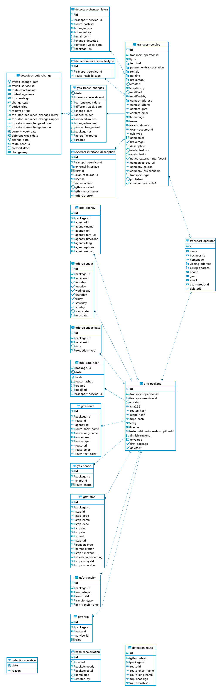
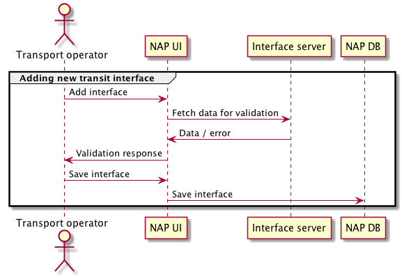
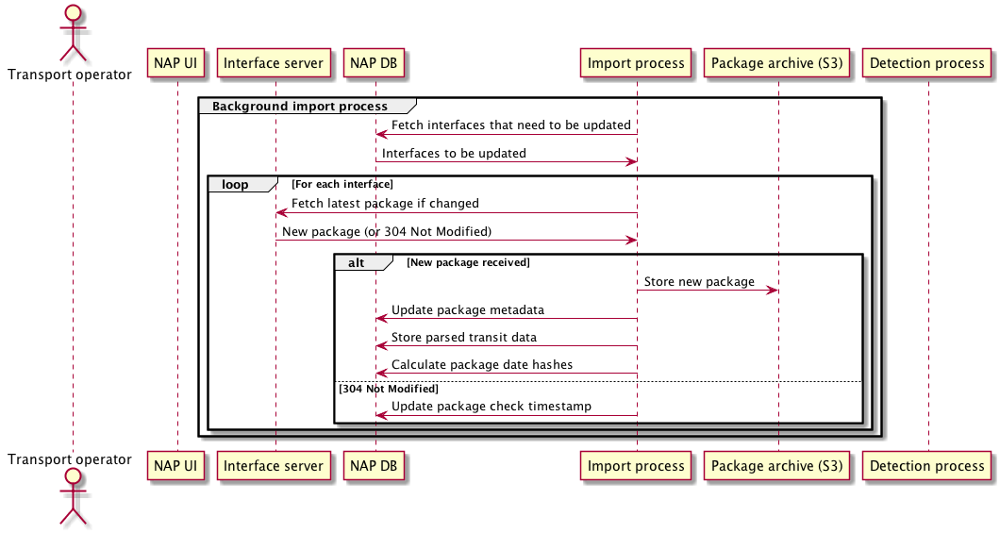
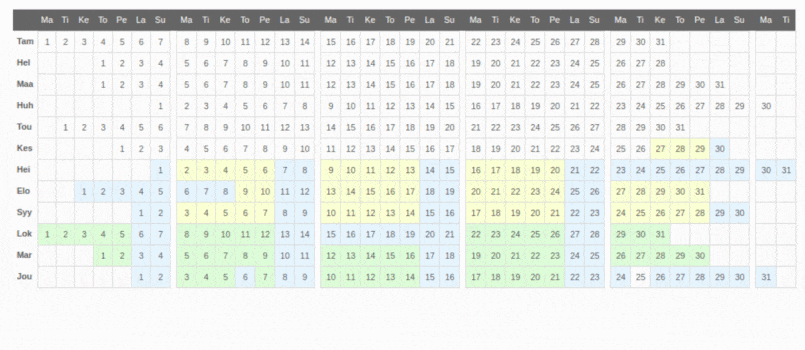
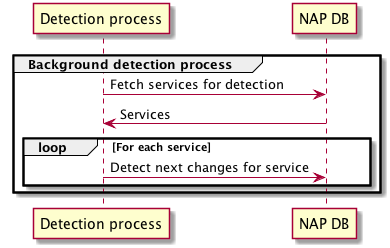
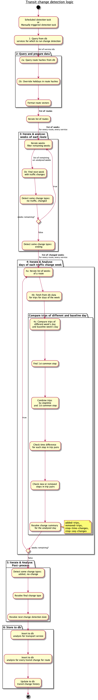
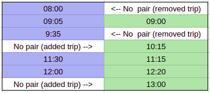

# Transit changes documentation

## References
[0]: https://github.com/finnishtransportagency/mmtis-national-access-point/commit/158eddc78bd5ce368dc3afc524b152d691f8b74b
[1]: http://www.finlex.fi/fi/laki/alkup/2017/20170320 "Laki liikenteen palveluista"
[2]: https://developers.google.com/transit/gtfs/

- https://github.com/finnishtransportagency/mmtis-national-access-point/commit/158eddc78bd5ce368dc3afc524b152d691f8b74b
- http://www.finlex.fi/fi/laki/alkup/2017/20170320 "Laki liikenteen palveluista"
- https://developers.google.com/transit/gtfs/

### Release version
Git version used as baseline for this documentation: [link][0]

## Description

### Need
EU legislation requires a National Access Point (NAP) to be implemented by member states.
In addition to mandatory features, Finnish NAP implements additional custom features.  
Transit Change detection is a custom feature, which allows ELY centers 
(Centre for Economic Development, Transport and the Environment in Finland) 
to examine transit data of transit services. Transit data of a transit service is declared by its operator. 
Transit change detection allows ELY officials to analyze whether any ELY actions will be required in order to react to 
some of the changes in transit service traffic.

### Requirements
According to [Finnish national legislation on transport][1], 
a transport operator must declare changes to transit service routes 60 days in advance to the transit authorities.  
Legislation also states that transit service data must be made available via a machine-readable interface in a common, easily modifiable format.

NAP implements in a following way 
* Transit data for a service is automatically imported by periodically reading machine-readable interfaces of each service. 
* An automated analysis procedure is run periodically on the imported data
* National Transit authorities (certain users) are notified on the analysis result. 
* If a machine readable interface is not available for a transit service, then transit changes must be declared using a manual online form, which is available via NAP web application. 
Manually declared transit data is visualized separately for transit authorities by NAP application online view. It is not involved in automated Transit change detection feature.

## Datamodel

- `detected-change-history` : stores first occurrence when a change is detected using a calculated hash value
- `detected-route-change` : each record represents one detected change for one route for one service. Includes a link to a `gtfs-transit-changes` record.
- `external-interface-description` : each record represents an external interface for a transit service. Includes URLs where to import data and related attributes like timestamp of last import.
- `gtfs-transit-changes`: each record represents the result of one transit detection run for one service 

## Functionality

### Machine-readable interface for transit service

Machine-readable interfaces of transport service are defined by a user belonging to organization of the transport operator, which is providing the transport service.  
Definition of interfaces for a service is done using the NAP application UI, using the edit transport service view.
Interface details are stored to transit service record in NAP database.  
Important attributes for an interface are the **URL** and **format** of provided data.

### Transit service data import

(Reasoning for feature: chapter [Requirements](#Requirements))

NAP service reads existing transit route and schedule information from the 
machine-readable interfaces of transit service. Import is an enabler for automated transit change analysis at a later stage.  
Imported data is stored to NAP internal database.  
Import runs every night during specified hours.  
Import runs iteratively one service at a time during the scheduling window (reference: `GtfsTasks`).

Formats supported for machine-readable transit data interfaces are 
[GTFS][2] and [Kalkati.net](http://developer.matka.fi/pages/en/kalkati.net-xml-database-dump.php).  
Supported file transfer format for import is **zip** archive file. 

An imported package file is parsed and stored into NAP database into relational database model.  
The model is not an exact mirror of the GTFS standard, but it is logically very similar and contains the same information.  
The NAP import procedure of GTFS-formatted transit data supports mandatory GTFS files of the GTFS specification and two optional files: **calendar_dates.txt** and **shapes.txt**.  
For more information on GTFS files refer to [GTFS file requirements](https://developers.google.com/transit/gtfs/reference/#file-requirements)

1. Fetch interfaces which qualify for new data import run
   - `gtfs_imported timestamp` older than one day ago
0. Receive list of interfaces. Resolve service which to update.
   - **Importing done to only _one_ (first) service** per scheduled import task iteration.
0. Fetch latest package for interface URL
   - Package fetch is run for interfaces whose import timestamp in NAP db `external-interface-description` is not within last **24 hours**.
   - Check if interface URL can be connected to. 
   - If interface server indicates that data has changed, downloaded and proceed to process response.
0. Analyze response
   - HTTP headers **`If-None-Match`** or **`If-Modified-Since`** are used to resolve if new data is available. 
   - Verify package contains all files required for the interface format. 
   - Verify downloaded file is a ZIP archive file 
0. Update package metadata into NAP db interface table.  
   - Store relevant package metadata, such as **ETAG** and **timestamp**.
   - Mark interface as erroneous if there were errors for fetch or import operations. 
0. Convert if required
   - Kalkati.net formatted interfaces are converted into GTFS before storing and importing the data.  
   Conversion is done using a `kalkati->gtfs` converter which parses Kalkati.net XML files and outputs a GTFS zip.
0. Calculate package hash
0. Store downloaded package to package archive repository
0. Store parsed transit service data to NAP db.
0. Update package metadata into NAP db interface table
   - `external-interface-description/gtfs-imported`

##### References
   - https://github.com/finnishtransportagency/mmtis-national-access-point/blob/master/ote/src/clj/ote/tasks/gtfs.clj
   - [Transit changes db tables](#Datamodel)

### Change Detection 

User UI visualization of transit change detection results
  

#### Scheduling

- **1:** Change detection task is scheduled to run every night _after_ transit data import task scheduling window. 
   - `detect-new-changes-task`
   - Resolve detection start and end dates. By default start date is current date, 
   admin may choose to do a run using a custom date.  
- **2**: Resolve services for which to run change detection
   - `services-for-nightly-change-detection`
   - If there's a new package or if earliest change-date is in past  
- **4:** Query a list of transit package records for each selected transport service
   - `service-package-ids-for-date-range` 
- **6**: Detect changes
   - latest transit package record for each service
   - `detect-route-changes-for-service` parses route day hashes read from db and produces detection result vector per route.
   - `update-transit-changes!` does further analysis for results and implements the last steps of the detection logic.
- **7:**  Store results to db
   - `update-transit-changes!` stores final results to db
   `gtfs-change-result`, `detected-route-change` (For details refer to [Datamodel](#Datamodel))

##### References
   - https://github.com/finnishtransportagency/mmtis-national-access-point/blob/master/ote/src/clj/ote/tasks/gtfs.clj
   - [Transit changes related db tables](#Datamodel)
   
#### Detection algorithm

##### Important notes
- Change detection is run periodically for the **latest imported** transit data packages.  
- No history data is used from preceding imports or analyses. Latest package is analysed independently
- Separate detection runs for the same service will detect same changes as the previous run, if the data is the same. 
- Route traffic changes detected for current week when detection is run, will be reported on next week instead, except **added** and **ending** routes.
- Thresholds
  - Detection window: service's route data analyzed into future for: **120** days 
  - Route end: route marked 'ending' if no traffic within next: **90** days
  - Detection interval for service: detection for every service scheduled every: **14** days  
  (Notice: this is different than detecting task scheduling)
  - Change window: A change is recorded if duration of differences in traffic hash continue at minimum: **2 weeks**
  - No-traffic threshold: A 'no-traffic' change for route is reported if duration is at mimimum: **16 days**
  
##### Sequence

- 1: **Query from db services.**   
The detection algorithm processes one transport service per time.  
On this run those services are selected for change detection, which qualify for a new run. 
(Reference: `services-for-nightly-change-detection`)
- 2a: **Query route hashes from db.**  
Fetch all routes for selected services. A route record includes information about route start and end times as well as unique hashes.  
Routes that have already ended are removed from further inspection.
- 2b: **Override holidays in route hashes**  
Holidays are earmarked by replacing day traffic hash using a keyword value. 
Replacing allows later steps to handle holidays.  
Holiday dates are configured to NAP application itself.
- 3b: **Find next changed week.**  
Iterate weeks: compare 'current' week and a week in the future. Week is analyzed by comparing _day hashes_ of the same weekdays of the two separate weeks.  
For efficiency, only simple day hash string comparison is done instead of detailed analysis of the daily routes and trips.  
_Holiday days are skipped in analysis_ because they typically have different traffic, but such short changes are of no interest to user.  
Return a map which specifies date of detected changed week, and date to which 'current' week it was compared to.
If algorithm does not find a different week, it returns just that there is traffic for the route.  
(Reference: `detection.clj`)  
- 4: **Analyse days of each changed week**  
   Iterates the list of weeks with traffic changes, received from previous step.  
   First weekday is selected for comparison on both weeks, after analysis is done then second days pair is selected, until all weekdays have been compared as pairs (Mon-Mon, Tue-Tue etc).
   - 4b: **Query from db detailed trip data** for the selected weekday of analysis week and of baseline week.
   - 4c: **Compare trips of a day**  
   The in-depth comparison of the two differing days generates trip, stop sequence and stop time differences per route.  
       - **Trip differences**  
          
          
          Trip comparison finds the first common stop that is in every trip. Then the trips of the compared days
          are combined using the common stop as a basis.  
          This helps aligning the trip stop times next to each other so they can be easily compared. In the merging process, time differences of the trip stop time pairs are computed.  
          Any compared trip stop time that is not within 30 minute time window causes the algorithm to mark the
          trip either added or removed.  
          (Reference: `route-day-changes-new` iterates changed weeks and adds day change comparison)
       - **Stop sequence differences**  
         Stop sequence differences are computed per compared trip pair. The algorithm detects stops that are added or
         removed from a trip by comparing the stop sequences of the trips.
       - **Stop time differences**  
         Stop time differences are computed per compared trip pair. The departure time differences are computed for each 
         matching stop pair

- 5: **Post-process**
  - Due to legacy reasons there is an additional post-processing stage.  
  - Last and final part of logic for resolving transit service change type and route change types.
  - Resolve next change detection analysis date for service
  - Resolve summary statistics fro service's changes (sums of different trip changes)
  - Convert data structures to match the relational data model of database. 
  - Reference: `update-transit-changes!`, `transform-route-change`
- 6: **Store to db**
  - Reference:   
  `update-transit-changes!`  
  Updated db tables `transit-changes`, `detected-route-change`, `detected-change-history`

## Additional information

### Route day hash calculation
Route analysis is not done using raw data. 
Instead a hash checksum is calculated from raw data. 
A hash string provides a unique signature of the traffic during a specific day. Hash comparison is efficient in first-level analysis where only days and weeks with different traffic are detected.  
Hash calculation for traffic of one route during one day compresses all the related stop names and stop times used by the route trip stop sequences.  
Stop coordinates are also included, but for them accuracy is reduced by using only *three* first decimals of lat and lon coordinates (reference: `calculate-fuzzy-location-for-stops!`).

### Notifications on transit change detection results

Notifications about newly detected transit changes are sent via email to transit authorities each day.  
In order to have transit changes included to notification only on the first time when they are detected, 
a unique hash value is calculated on each route change and stored to db`detected-change-history`. 
Notification is composed using data from this table.

### Holiday dates

A static list of holiday dates is defined statically in `transit-changes/static-holidays`. 
Operation to import a list of holiday date definitions may be triggered via the admin user on the admin UI. Results are stored into database `detection-holidays`. 
Transit change detection will prefer the list retrieved from db and if list is not available, fall back to the static list. 

## Notes for developers

### How to run 

- Test using unit tests
- Test by running locally end-to-end:
  - Create an operator and service
  - Add an interface for service, enter a valid URL where a package may be downloaded
  - On admin view trigger downloading of a new transit data package
  - Run detection
    - Run locally via REPL: `(detect-new-changes-task (:db ote.main/ote) true [ids])`
    - Run run via browser admin view > start change detection
  - Analyze results on transit-detection view and on db tables
