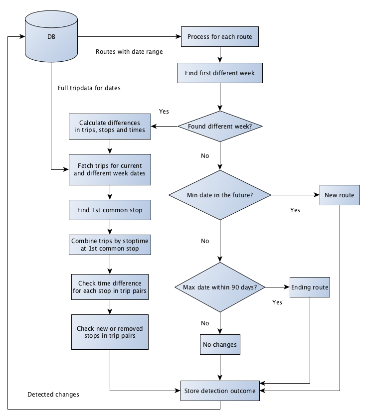

# Transit changes documentation

## References
[0]: https://github.com/finnishtransportagency/mmtis-national-access-point/commit/158eddc78bd5ce368dc3afc524b152d691f8b74b
[1]: http://www.finlex.fi/fi/laki/alkup/2017/20170320 "Laki liikenteen palveluista"
[2]: https://developers.google.com/transit/gtfs/

- https://github.com/finnishtransportagency/mmtis-national-access-point/commit/158eddc78bd5ce368dc3afc524b152d691f8b74b
- http://www.finlex.fi/fi/laki/alkup/2017/20170320 "Laki liikenteen palveluista"
- https://developers.google.com/transit/gtfs/

### Release version
Git version used as baseline for this documentation: [mmtis-national-access-point][0]

## Description

### Need
EU legislation requires a National Access Point (NAP) to be implemented by member states.
In addition to mandatory features, Finnish NAP implements additional custom features. 
Transit Change detection is a custom feature, which allows ELY centers 
(Centre for Economic Development, Transport and the Environment in Finland) 
to examine transit data of transit services. Transit data of a transit service is declared by its transit operator. 
Transit Change detection allows ELY officials to analyze whether any ELY actions will be required in order to react to 
some of the changes in transit service traffic.

### Requirements
According to [Finnish national legislation on transport][1], 
a transport operator must declare changes to transit service routes 60 days in advance to the transit authorities.
The legislation also states that transit service data must be made available via a machine-readable interface in a common, easily modifiable format.

NAP implements this so, that 
* Transit data is automatically imported from service's machine-readable interfaces (refer to [Transit data import](#Transit data import)) 
* An automated analysis procedure is run on the imported data
* National Transit authorities (certain users) are notified on the analysis result. 
* If a machine readable interface is not available for a transit service, then transit changes must be declared using a manual online form, which is available via NAP web application. 
Manually declared transit data is not used by the automated analysis procedure. It is visualized separately for transit authorities by NAP application online view.

## Data model

### Important tables related to transit change detection
- `detected-change-history` : stores first occurrence when a change is detected using a calculated hash value
- `detected-route-change` : records link to a gtfs-transit-changes record. Each record represents one detected change for one route for one service.
- `external-interface-description` : URLs where to import data from and related attributes like a last import timestamp
- `gtfs-transit-changes`: one record represents the result of one transit detection run for one service 

## Functionality

### Machine-readable interface for transit service

Machine-readable interfaces of transport service are defined by a user belonging to organization of the transport operator, which is providing the transport service.  
Definition of interfaces for a service is done using the NAP application UI, using the edit transport service view.
Interface details are stored to transit service record in NAP database.  
Important attributes for an interface are the **URL** and **format** of provided data.

### Transit service data import

(Reasoning for feature: chapter [Requirements](#Requirements))

To enable automated transit change analysis, NAP reads existing transit route and schedule information from the 
machine-readable interfaces of transit service.  
Imported data is stored to NAP internal database. Analysis of imported transit happens at a later stage.  
Import process for transit service data runs every night during specified hours.  
Import runs iteratively one service at a time.

Formats supported for machine-readable transit data interfaces are 
[GTFS][2] and [Kalkati.net](http://developer.matka.fi/pages/en/kalkati.net-xml-database-dump.php).  
Supported file transfer format for import is **zip** archive file. 

An imported package file is parsed and stored into NAP database into relational database model.  
The model is not an exact mirror of the GTFS standard, but it is logically very similar and contains the same information.  
The NAP import procedure of GTFS-formatted transit data supports mandatory GTFS files of the GTFS specification and two optional files: **calendar_dates.txt** and **shapes.txt**.  
For more information on GTFS files refer to [GTFS file requirements](https://developers.google.com/transit/gtfs/reference/#file-requirements)

1. Fetch interfaces which quality for import
   - `gtfs_imported timestamp` older than one day ago
0. Receive list of interfaces. Resolve service which to update.
   - **Importing done to only _one_ (first) service** per scheduled import task iteration.
0. Fetch latest package for interface URL
   - Package fetch is run for interfaces whose import timestamp in NAP db `external-interface-description` is not within last **24 hours**.
   - Check if interface URL can be connected to. 
   - If interface server indicates that data has changed, downloaded and proceed to process response.
0. Analyze response
   - HTTP headers **`If-None-Match`** or **`If-Modified-Since`** are used to resolve if new data is available. 
   - Verify package contains all files required for the interface format. 
   - Verify downloaded file is a ZIP archive file 
0. Update package metadata into NAP db interface table.  
   - Store relevant package metadata, such as **ETAG** and **timestamp** .
   - Mark interface as erroneous if there were errors for fetch or import operations. 
0. Convert if required
   - Kalkati.net formatted interfaces are converted into GTFS before storing and importing the data.  
   Conversion is done using a `kalkati->gtfs` converter which parses Kalkati.net XML files and outputs a GTFS zip.
0. Calculate package hash
0. Store downloaded package to package archive repository
0. Store parsed transit service data to NAP db.
0. Update package metadata into NAP db interface table
   - `external-interface-description/gtfs-imported`

##### References
   - https://github.com/finnishtransportagency/mmtis-national-access-point/blob/master/ote/src/clj/ote/tasks/gtfs.clj
   - [Transit changes related db tables](#Data model)

### Change Detection 

User UI visualization of transit change detection results
  

#### Scheduling

1. Change detection task is scheduled to run every night _after_ transit data import task scheduling window. 
   - `detect-new-changes-task`
   - Resolve detection start and end dates. By default start date is current date, 
   admin may choose to do a run using a custom date.
1. Resolve services for which to run change detection
   - `services-for-nightly-change-detection`
   - If there's a new package or if earliest change-date is in past 
1. 
1. Query a list of transit package records for each selected transport service
   - `service-package-ids-for-date-range` 
1. 
1. Detect changes
   - latest transit package record for each service
   - `detect-route-changes-for-service-new` parses route day hashes read from db and produces detection result vector per route.
   - `update-transit-changes!` does further analysis for results and implements the last steps of the detection logic.
1. Store results to db
   - `update-transit-changes!` stores final results to db
   `gtfs-change-result`, `detected-route-change` (For details refer to [Data model](#Data model))

##### References
   - https://github.com/finnishtransportagency/mmtis-national-access-point/blob/master/ote/src/clj/ote/tasks/gtfs.clj
   - [Transit changes related db tables](#Data model)
   
#### Detection algorithm

1. **Fetch route data**  
   The detection algorithm processes one transport service per time. It fetches all the routes per service including 
   information about route start and end times and the generated route hashes.
    1. From this data all the routes that are already ended are removed from further inspection.
    
1. **Find the first different week in traffic**  
   Next, the algorithm compares current week and the first week with different traffic somewhere in future.
   In order to find the first different week, daily traffic of each week is compared and the process tries to find a week
   from future that has different daily traffic. The daily route hashes are utilized in this process as they provide 
   an unique signature of the traffic during a specific day.
    1. Note: Detection skips temporary different weeks in this process, caused by christmas holidays and such, to prevent
       false positives in detection results.
   
   **No different weeks found**  
   If the algorithm does not find a different week, it can determine if the route is starting or ending using the start
   and end times information related to the route. If the currently inspected route has a start date in future the
   algorithm marks it as a new route. If the route has an ending date within 90 days, it is marked as an ending route.
   Otherwise the algorithm assumes that there is no changes in the route.
   
   **A differing week was found**  
   If there is a different week in future, the alorighm starts comparing specific dates of the week in more depth per 
   route.

1. **Compare differing dates**  
   After the process has found a week in future that has different traffic than current week, the first day is picked 
   from the different week that starts the new traffic pattern. Then, the process picks the matching week day from
   current week and compares the traffic of these two days in depth.
   The in-depth comparison of the two differing days generates trip, stop sequence and stop time differences per route.
    
    1. **Trip differences**  
       
      
       The algorithm fetches trips of route for the current day and the different week day. The trip comparison works in the
       following way. First, it tries to find the first common stop that is in every trip. Then the trips of the compared days
       are combined using the common stop as a basis. This helps lining up the trip stop times next to each other so they
       can be easily compared. In the merging process, time differences of the trip stop time pairs are computed.
       Any compared trip stop time that is not within 30 minute time window causes the algorithm to mark the
       trip either added or removed.
      
    1. **Stop sequence differences**  
      Stop sequence differences are computed per compared trip pair. The algorithm detects stops that are added or
      removed from a trip by comparing the stop sequences of the trips.
      
    1. **Stop time differences**  
      Stop time differences are computed per compared trip pair. The departure time differences are computed for each 
      matching stop pair.
 

#### Route hash calculation
Route analysis is not done using raw data. Instead a hash checksum is calculated from raw data. 
Reasoning is to simplify comparison of traffic of a route on weekly basis, as well as on daily basis.  
Hash calculation for traffic for one route during one day compresses all the related stop names and stop times used by the route trip stop sequences.  

### Notifications on transit change detection results

Notifications about newly detected transit changes are sent via email to transit authorities each day.

